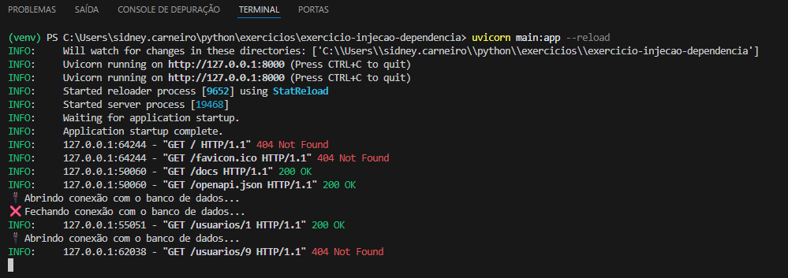
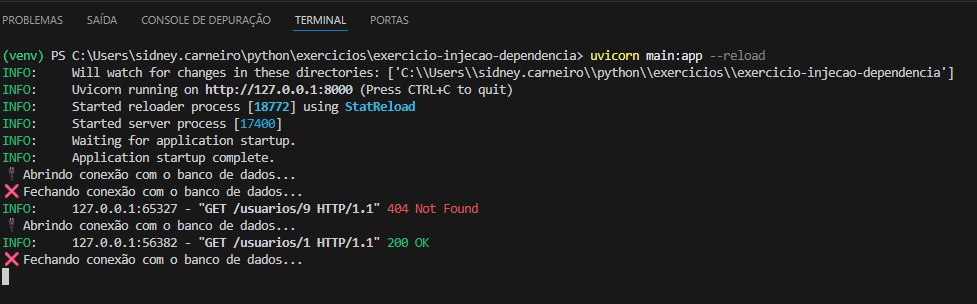

# 💉 Exercício 06: Injeção de Dependências e Conexões Seguras

Este projeto faz parte da série de desafios práticos de Backend. O objetivo deste módulo é demonstrar a importância da **Injeção de Dependências (DI)** para gerenciar o ciclo de vida de recursos críticos, como conexões de banco de dados.

## 🔴 O Problema: Vazamento de Conexões (Memory Leak)
A abordagem ingênua no desenvolvimento Backend é instanciar a conexão com o banco de dados e fechá-la manualmente dentro da própria rota. 
* **O Risco:** Se ocorrer uma exceção (como um erro 404 - Não Encontrado) antes da linha que fecha o banco, a conexão fica "pendurada". Com o tempo, o pool de conexões do banco esgota e a API cai.

**Evidência do Problema:**
No print abaixo, ao buscar um usuário inexistente (ID 9), a API retorna o erro 404, mas a conexão com o banco nunca é fechada.


## 🟢 A Solução: FastAPI `Depends` e `yield`
Para resolver isso, transferimos a responsabilidade de gerenciar a conexão para o framework utilizando Injeção de Dependências com uma função geradora (`yield`).

1. A conexão é aberta.
2. O banco é "injetado" na rota usando `Depends()`.
3. O bloco `finally` garante que o banco **sempre** será fechado, independentemente de erros ou exceções que ocorram na rota.

```python
# A função geradora (Dependência)
def get_db():
    db = BancoDeDadosFalso()
    db.conectar()
    try:
        yield db 
    finally:
        db.fechar() # Fechamento garantido!

# A Rota
@app.get("/usuarios/{user_id}")
def obter_usuario(user_id: int, db: BancoDeDadosFalso = Depends(get_db)):
    # Lógica da rota...
````

**Evidência da Solução:**
No print abaixo, mesmo forçando o erro 404 no usuário ID 9, o log mostra que a conexão foi fechada com sucesso imediatamente após o erro.



## 🛠️ Tecnologias Utilizadas

  * Python 3.13
  * FastAPI (Dependency Injection System)
  * Uvicorn
